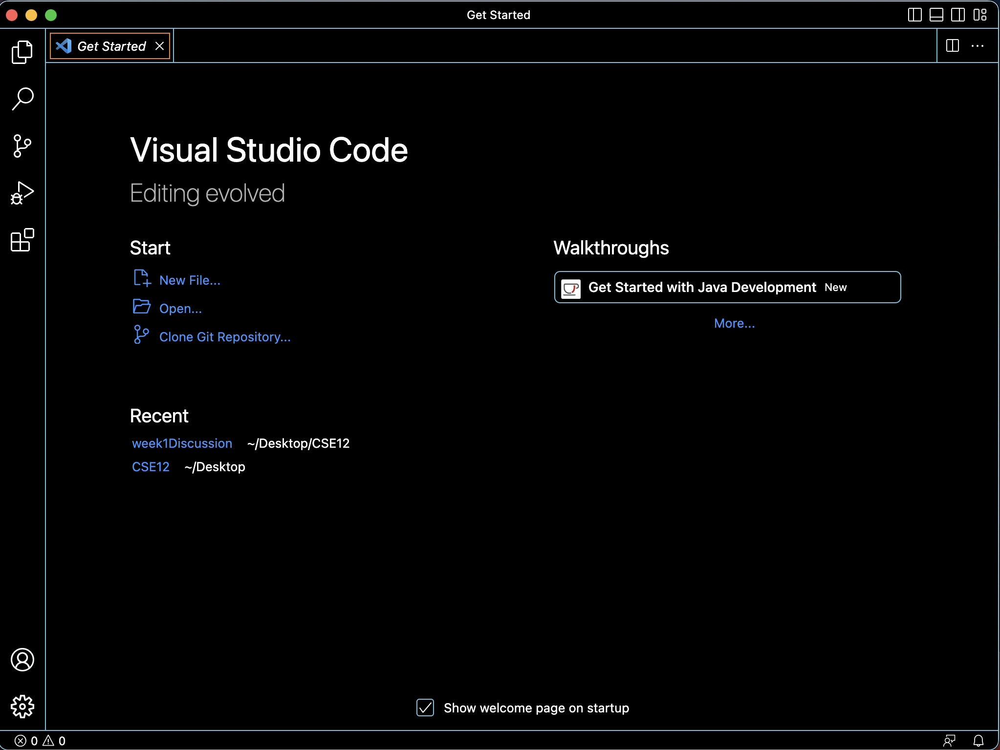
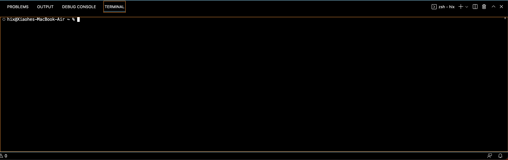
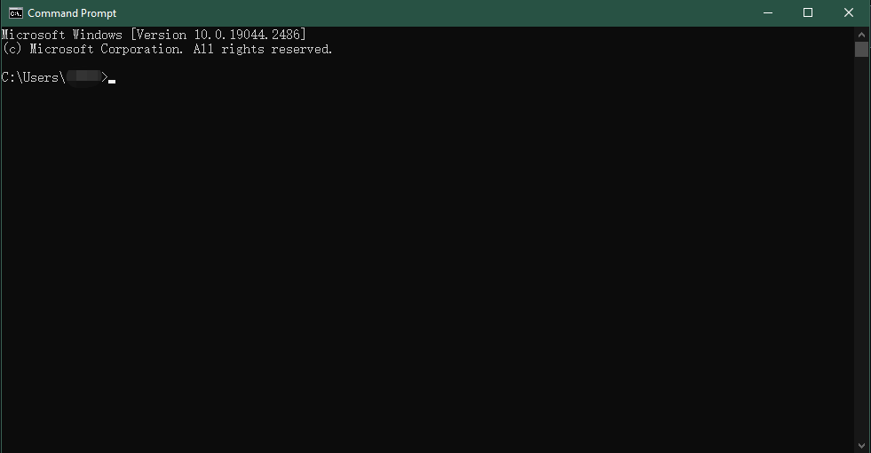
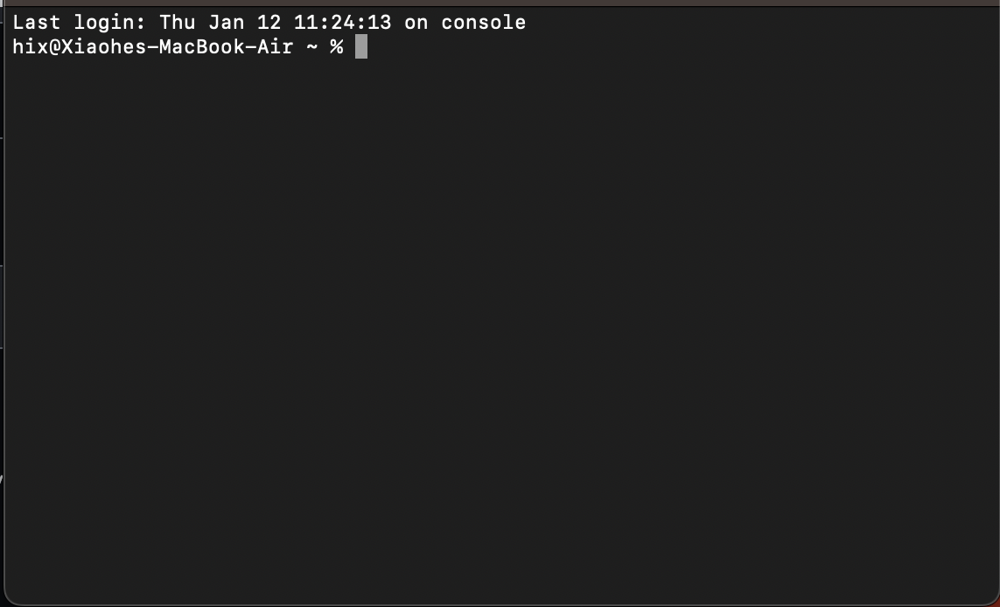
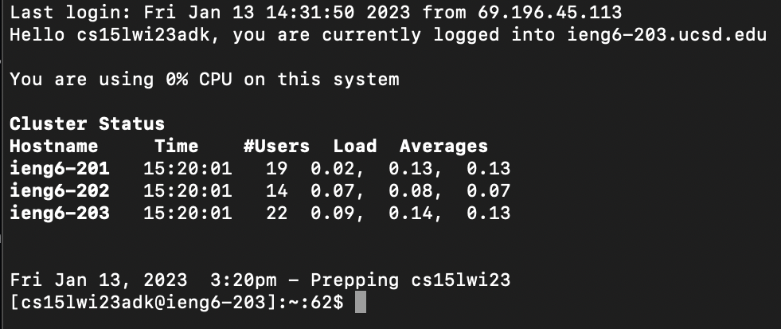
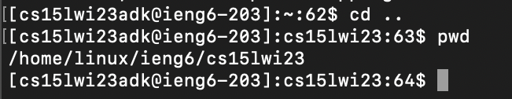

# Installation of Visual Studio Code

On Visual Studio Code website https://code.visualstudio.com/, select the version that matches your operating system and follow the instructions to download the files.
When firstly opened, there will be some settings to be completed. After all settings are settled, you should see a window with the same format but may be in different colors and themes.

---
# Remotely Connect to School's Server
> For Window users: Install [git](https://gitforwindows.org/) and use [bash](https://stackoverflow.com/a/50527994) in VS Code.
To access the server, you have to use the ***terminal***. There are multiple ways to open a terminal.
* In VS Code, you can type in 
```
Ctrl/Control/Command + "`"
```
or click `Terminal` on the top bar, and then click `New Terminal`.
* You may also open the terminal by utilizing Command Prompt on Windows or Terminal on Mac.
* A terminal looks like this:



Type in `ssh cs15laaaabbb@ieng6.ucsd.edu`, in which *cs15laaaabbb* is your course-specific account. The terminal will ask you a question below:
```
$ ssh cs15lwi23zz@ieng6.ucsd.edu
The authenticity of host 'ieng6.ucsd.edu (128.54.70.227)' can't be established.
RSA key fingerprint is SHA256:ksruYwhnYH+sySHnHAtLUHngrPEyZTDl/1x99wUQcec.
Are you sure you want to continue connecting (yes/no/[fingerprint])? 
```
This part of question is informing you that this is a new server that your computer is connecting to. If it is not the first time you are connecting to this server, and the question was still shown, it may indicate that the server was reconfigured or someone is messing up with you.

After replying yes, the terminal then asks you to input your password. You cannot see your password as you are typing, which is like the `********` without the `*`s. You should see such a scene when you have successfully logged in.

---
# Run Some Commands
There are "verbs" and "nouns" in syntax that you may be interested to use.
> Verbs:
> `cd` change directory, changing your working place to your designated area.
> `pwd` print working directory, you can use this to see where you are at.
> `ls` list all the files in the directory. `ls -a` will also show some hidden files.
> Nouns:
> `..` parent directory, go back one step from the file.
> `~` home directory.
> Other nouns may just be your file location, like `C/User/`
For instance, if I type in `cd`, then I have to have a noun after it, so I can type `cd ..`. Next, I can type `pwd` to see where I am at.

You may also check on the Internet to see other interesting commands, the server has sophisticated secure system to protect itself so that you can bully it freely :)
