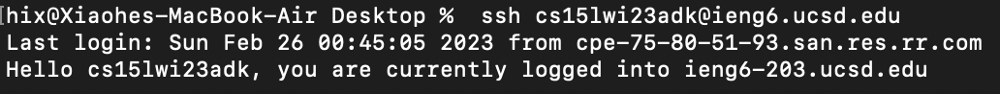
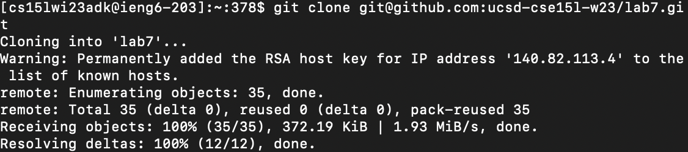
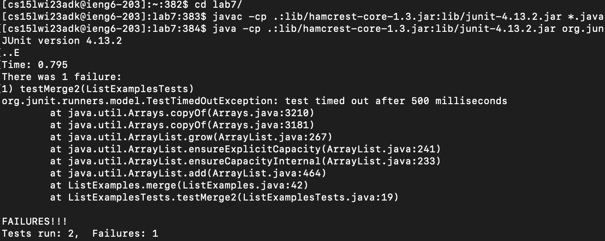
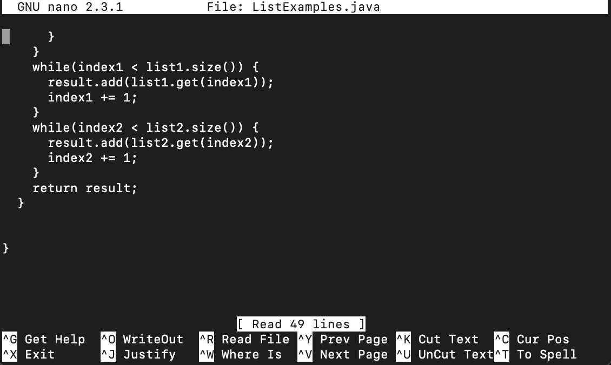
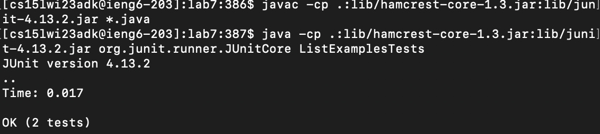
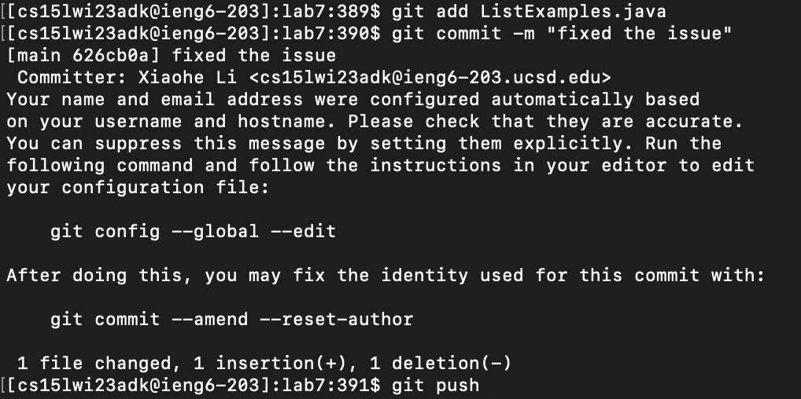

### Lab Report 4 ###

## Step 1 Log into ieng6 ##
`<control + R>` *Open the search function to search for history commands*
`ssh` *Search the command to log into remote server*

## Step 2 Clone your fork of the repository from your Github account ##
`git clone` *Copy files from a given website*
`<control> + V` *Copy the ssh link copied from git hub*

## Step 3 Run the tests, demonstrating that they fail ##
`cd l` + `<tab>` *Change directory into lab7/*
`javac -cp .:lib/hamcrest-core-1.3.jar:lib/junit-4.13.2.jar *.java` *Compile all java files through JUnit*
`java -cp .:lib/hamcrest-core-1.3.jar:lib/junit-4.13.2.jar org.junit.runner.JUnitCore Li` + `<tab>` + `<delete>` *Run the test*

## Step 4 Edit the code file to fix the failing test ##
`nano L` + `<tab>` + `.j` + `<tab>` *Open ListExamples.java file with nano*
*Change the Index1 at the bottom into Index2*
`<control> + X` + `Y` + `<return>` *Exit, confirm the change, confirm the name*

## Step 5 Run the tests, demonstrating that they now succeed ##
`<up><up><up><return>` *Get the `javac -cp .:lib/hamcrest-core-1.3.jar:lib/junit-4.13.2.jar *.java` command`*
`<up><up><up><return>` *Get the `java -cp .:lib/hamcrest-core-1.3.jar:lib/junit-4.13.2.jar org.junit.runner.JUnit ListExampleTests.java` command*

## Step 6 Commit and push the resulting change to your Github account ##
`git add L` + `<tab>` + `.j` + `<tab>` *Add the file to the adding list*
`git commit -m "fixed the issue"` *Commit the change to the file, and add a message to the commit*
`git push` *Push the file to Github*

