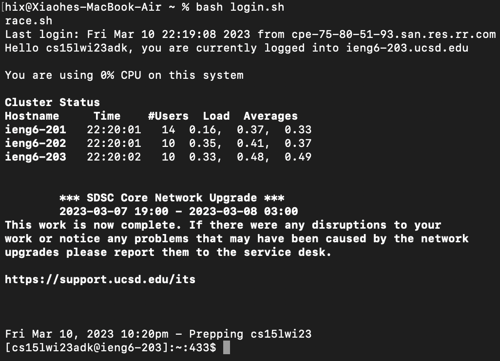
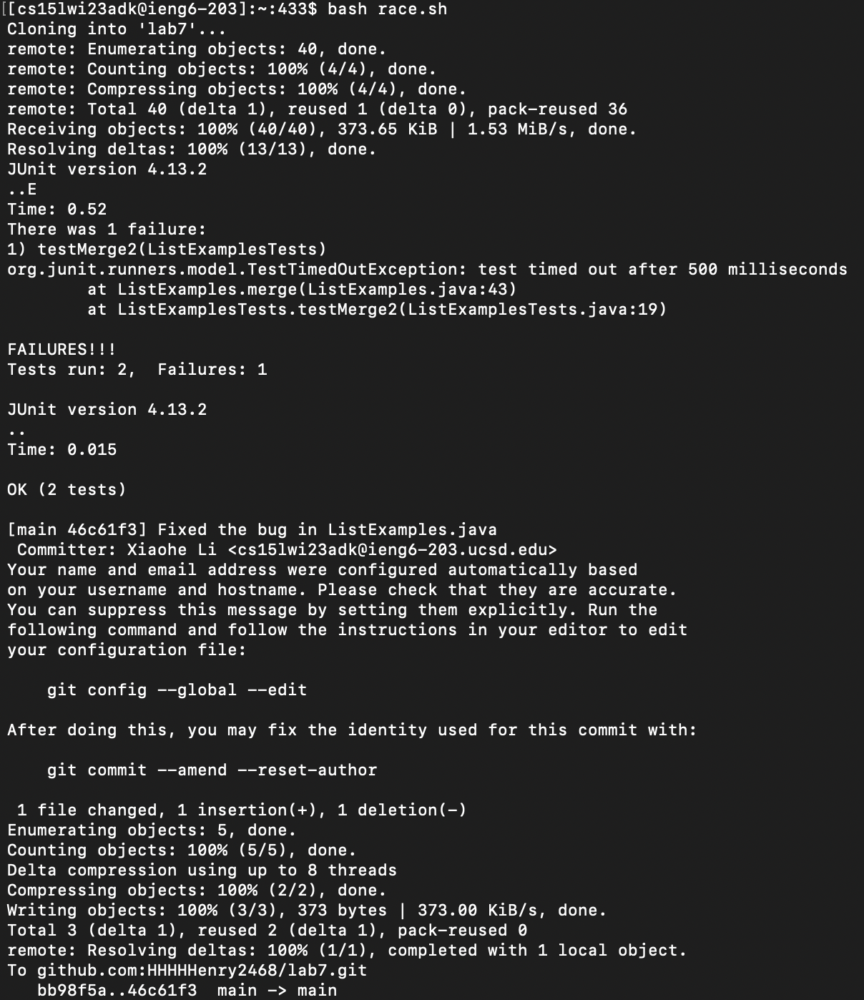

### How to fix a file from GitHub like a flash ###
# PS: Error in the file is already known #

## Writing a bash script ##
A bash script is a time saving machine, because only one command that calls the script can help you run infinite commands contained in the script. The script in this scenario should:


* download the file from GitHub
* compile and run the tests
* fix the problem
* recomplie and run the tests
* push the file back to GitHub


Therefore, I have made the script below:

```
CPATH=".:/path/to/lib/hamcrest-core-1.3.jar:/path/to/lib/junit-4.13.2.jar"
JUNIT="org.junit.runner.JUnitCore"
git clone git@github.com:HHHHHenry2468/lab7.git
cd lab7/
javac -cp $CPATH *.java
java -cp $CPATH $JUNIT ListExamplesTests
sed -i '43s/index1/index2/' ListExamples.java
javac -cp $CPATH *.java
java -cp $CPATH $JUNIT ListExamplesTests
git add ListExamples.java
git commit -m "Fixed the bug in ListExamples.java"
git push
```

`CPATH` and `JUNIT` are two variables that I made to save typing. `git clone` clones the file through ssh. `cd` would change directory into the directory. `javac` and `java` compiles and runs the test. `sed` changes the known error into correct form. `git add`, `git commit`, and `git push` would add the file to the list, commit the change, and push the file back to repository.

## Running the script on remote server ##
Simply having a script is not enough. I cannot run my script on my laptop to command the remote server's terminal. Thus, I have to copy my script onto the remote server, and then run it on the server.

Thus, I had another simple script that helps me to log in.

```
ACCOUNT="cs15lwi23adk@ieng6.ucsd.edu"
scp ~/race.sh $ACCOUNT:~
ssh $ACCOUNT
```

Now, running this script and then run the script on remote server, I can finish my test.

## Did it work? ##
Of course.
Firstly, I type `bash login.sh` to copy the race.sh script onto remote server and log in to the server.



Then, I type `bash race.sh` to run the script.



The first `JUnit version 4.13.2` is the test ran before changing, and the second on is the test ran after changed. We can see the first test failed and the second succeeded.

## Inference and reflection ##
Utilizing bash script is very convenient for coders to do something useful. If we could have something that automatically detect the error in the file, like linking it to *ChatGPT* (although it is not stable right now in debugging), then maybe we could generate a script that automatically fix the problem in the file. That might be a way for teachers in middle schools or high schools to revise students' coding homeworks.