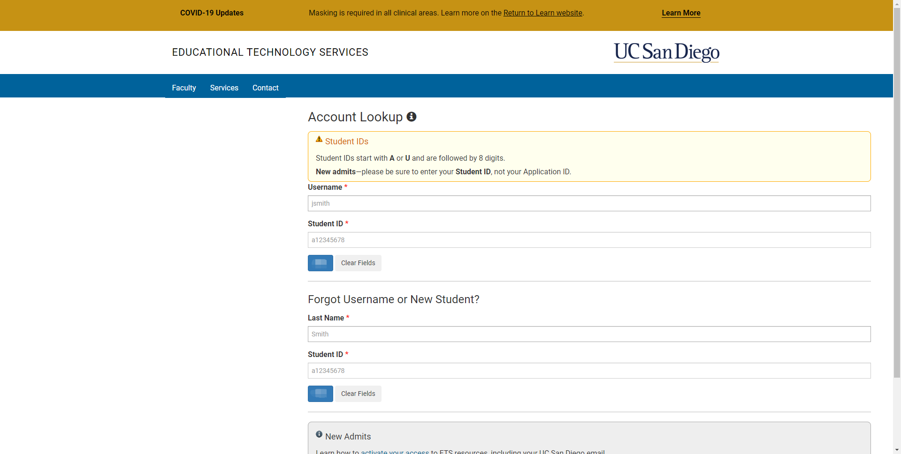
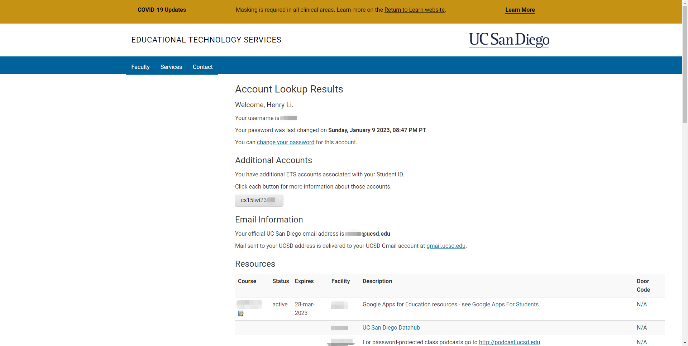
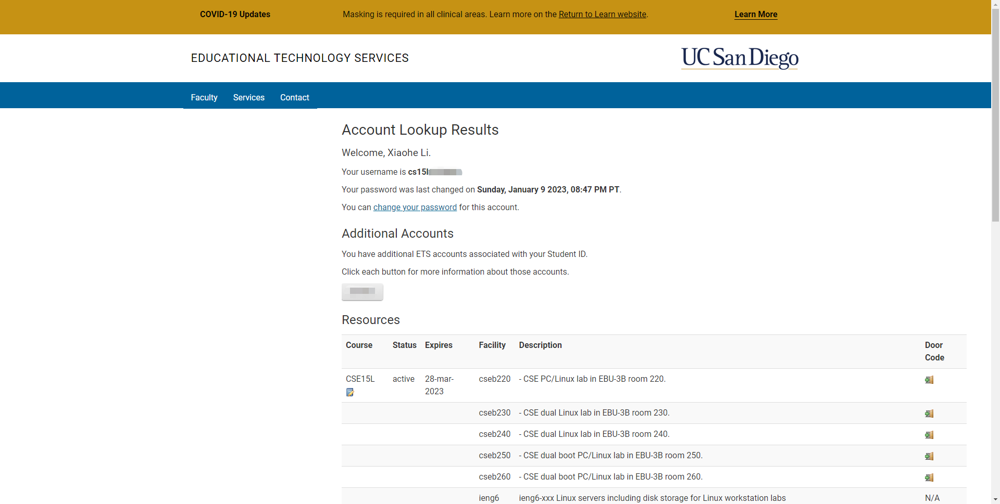
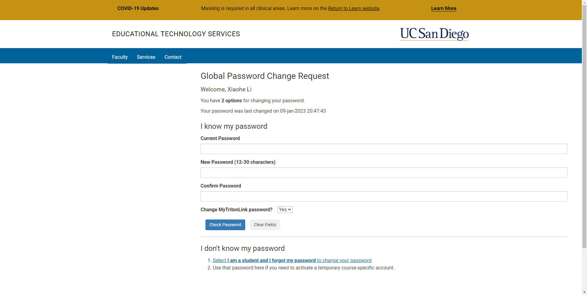
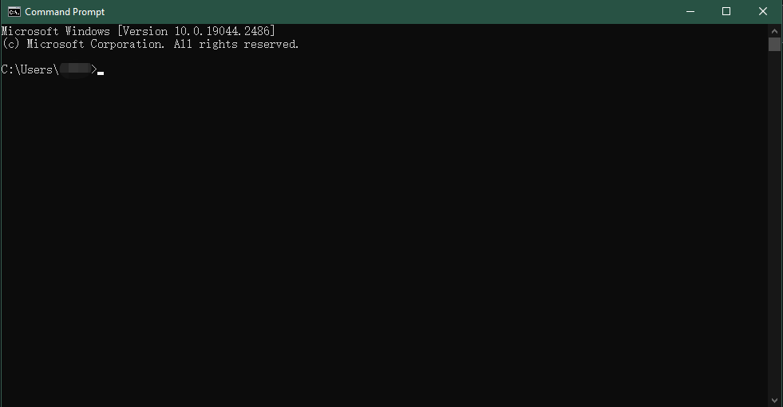
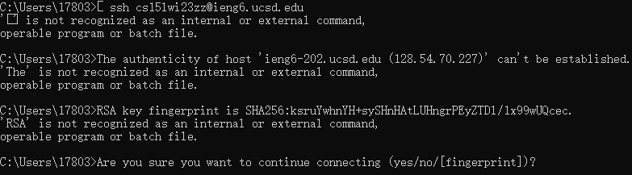

# Be an amateur supervised restricted hacker (first step)

## Step 1: Know your hacker account
* Click [this](https://sdacs.ucsd.edu/~icc/index.php).
* You should see the picture below:

* Fill out the first two lanes with your given username and your PID.
> Your username is a part of your school email account, like `cse15l` for `cse15l`@ucsd.edu.
* Click the blue button that is on the left of the button `Clear Fields`.
* You should see the picture below:

* Above `Email Information`, you should see your specific account name. 
>It should be in the form of "cs15l*aabbccc*". *aa* is the quarter you are taking this course, "sp", "fa", or "wi". *bb* is the quarter's year, "22", "23", etc. *ccc* is your hacker's specific letters.

## Step 2: Create your hacker's password
```
A hacker cannot let the computer easily accessed by others.
So you must have a password to prove to your computer, that you are its hacker master.
```
* Click your hacker account.
* It should look like this:

* Click **change your password**.

* Enter your current password of your student account.
* Create your new password and confirm it (a hacker at least should be able to remember that).
* Select `No` for `Change MyTritonLink password?`, if you don't want to change it.
* Now it is the threshold to decide if you can be a hacker:
> Put your cursor on the input field of `Confirm Password`, click once, and press `Enter` on your keyboard.
* If the next page says `Success!`, it's congratulating you on being qualified to be a hacker.

## Step 3: Act like a hacker
* Firstly, you have to have that slay window that has black background and white letters.
> If you are using MacBooks, press `Command` and `Space` together, and search `terminal`
> If you are using Windows, search for `Command Prompt` on the side bar `Type here to search`.
* The slay window looks like this:

* Type in `ssh cs15l*aabbccc*@ieng6.ucsd.edu`, "cs15l*aabbccc*" is your hacker account.
* Then it should ask you a question:

* Tell it "yes".
* Type in your hacker password you just made, don't tell me you forget it.
* Now you should see something that you can tell you succeed, if you haven't, repeat the steps!!!
