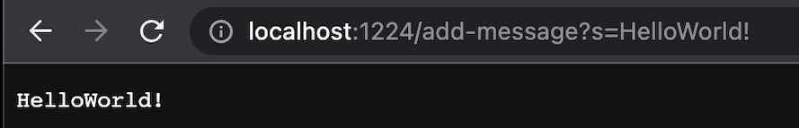

# Lab Report 2
## Part1
Code:
```
import java.net.URI;
import java.io.IOException;

class Handler implements URLHandler{
    String[] elements;

    public String[] resize(String[] sa){
        String[] toReturn = new String[sa.length + 1];
        for(int i = 0; i < sa.length; i++){
            toReturn[i] = sa[i];
        }
        return toReturn;
    }

    public String handleRequest(URI url){
        if (url.getPath().equals("/")) {
            String s = "";
            if(elements == null){return "No message available.";}
            else{
                for(int i = 0; i < elements.length; i++){
                s += elements[i] + "\n";
                }
                return s;
            }   
        }
        else{
            System.out.println("Path: " + url.getPath());
            if (url.getPath().contains("/add-message")) {
                String[] parameters = url.getQuery().split("=");
                if (parameters[0].equals("s")) {
                    if(elements == null){
                        elements = new String[1];
                        elements[0] = parameters[1];
                        return parameters[1];
                    }
                    else{
                        String[] inter = resize(elements);
                        inter[elements.length] = parameters[1];
                        elements = inter;
                        String s = "";
                        for(int i = 0; i < elements.length; i++){
                            s += elements[i] + "\n";
                            }
                            return s;
                    }    
                }
            }
            return "404 Not Found";
        }
    }
}

class StringServer{
    public static void main(String[] args) throws IOException {
        if(args.length == 0){
            System.out.println("Missing port number! Try any number between 1024 to 49151");
            return;
        }

        int port = Integer.parseInt(args[0]);

        Server.start(port, new Handler());
    }
}
```
Screenshot 1:
---

> The method in my code that was called is `handleRequest`. In the part `else`, there is a scenario when no message has been added, `if(elements == null)`, so according to it, the string array `elements` was added with one capacity, then put the added message inside. The method returns this message on the page. Firstly, the message is stored in `parameters` array, at index 1. then `element[0]` was made equal to this value. This is the only value changed when calling this method.
 ***
Screenshot 2:
---

> The method in my code that was called is `handleRequest`. in the part `else`, there is another scenario when there is already existing element(s), and according to it, the string array `elements` was resized, and put the added message inside. The method then returns all the added message on page. As the method aforementioned, the `parameters` stores the incoming message, then the resized array `element` stores the message in the empty place. Afterwards, through a for loop, all the elements in `elements` are copied on to String `s` and returned.

## Part2
### Failure-inducing input:
```
int[] input2 = {3, 4, 5};
ArrayExamples.reverseInPlace(input2);
assertArrayEquals(new int[] {5, 4, 3}, input2);
```
### Input that doesn't induce a failure
```
int[] input1 = { 3 };
ArrayExamples.reverseInPlace(input1);
assertArrayEquals(new int[]{ 3 }, input1);
```
### Symptom
> failure-inducing input
---

---
> input that does not induce failure
---

### The bug
```
for(int i = 0; i < arr.length; i += 1) {
      arr[i] = arr[arr.length - i - 1];
    }
  }
```
The code after bug being fixed
```
int[] arrCopy = new int[arr.length];
    for(int i = 0; i < arr.length; i++){
      arrCopy[i] = arr[i];
    }
    for(int i = 0; i < arr.length; i += 1) {
      arr[i] = arrCopy[arr.length - i - 1];
    }
```
> The problem is that, after the first half has been changed, the second half is then changed. However, when they are transforming, they are transforming into the already changed elements that were changed before. To solve this, I copied this array as a template for the later transformation.
### Part3
Something that I learned was about constructing a web site. I never know that I could initiate a local server. With the help of Server.java, together with many times of trials I finally made my own local servers *searchEngine* and *StringServer*. It was a painful process, constantly debugging and compiling, and finally failing, then go back to the start of this painful loop. However, I learned about how to induce bugs and find them, and how to fix them. The patience and consistence in coding is something that I never imagined before. 

